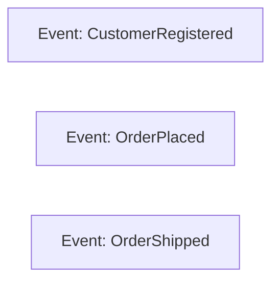
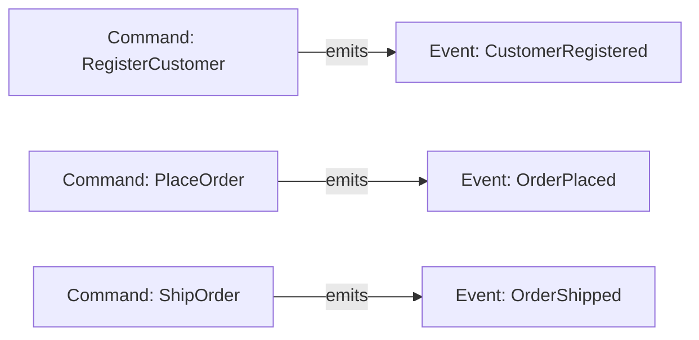
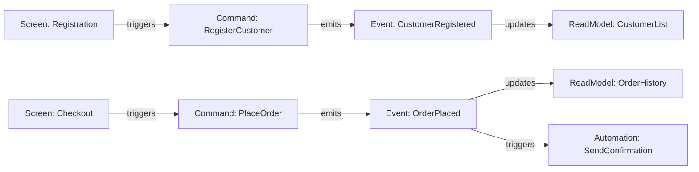

# Event Sourcing Methodology

Based on Martin Dilger's "Understanding Eventsourcing" (Chapters 1-44)

## Core Principles (Chapter 1: Foundation)

1. **"Not losing information" is the foundational principle.** Event Sourcing stores the facts that happened in the system in the order they happened, rather than just current state. This adds the dimension of time to your system.

2. **Use business language for events.** Events should be named as business facts that stakeholders understand. Say "Customer Blocked" not "set blocked flag on customer record." Events are facts expressed in past tense.

3. **Events tell the story of what happened.** First the customer was created, then moved to a new address, then made a purchase, then got promoted to premium status. The sum of these facts equals the current state.

## Building Blocks (Chapter 2)

**Events:** Immutable records of facts written in past tense ("Order Placed", not "Order is placing"). Once recorded, events cannot be changed. If there is no event, it didn't happen.

**Event Streams:** Chronological sequences of events for a particular business entity or process, identified by a stream_id. Design streams to be small and focused (typically 30-100 events per entity), NOT one global stream. Example: `stream-customer-47` for all events related to customer 47.

**Projections:** Views built from events for specific use cases. The same events can power many different projections (UI tables, reports, PDFs, CSVs, etc.). Key insight: you can build projections today that you didn't know you needed yesterday.

**Event Store:** The component that stores events. Can be a specialized store (Axon Server, EventStoreDB) or simply a PostgreSQL table with columns: id, stream_id, payload (JSON), metadata, type, version.

**Internal vs External Events:** Internal events belong strictly to one service/context. External (integration) events are stable contracts for distributing data between services. Never let external consumers read internal events directly.

**Key Mindset Shift:** Don't start from an existing data model and try to "event-source" it. Instead, focus on what happens in the system - record data as it flows through, not as static entities.

## The Four Patterns (Chapter 3: Event Modeling)

Event Modeling uses exactly four patterns to describe any information system:

**1. State Change** (Command → Event)
- A user interaction triggers a Command (blue), which results in an Event (orange)
- This is the ONLY way to modify state in the system
- Example: User clicks "Register" → `RegisterCustomer` command → `CustomerRegistered` event

**2. State View** (Events → Read Model)
- Events feed into a Read Model (green) which provides data to screens or processes
- Read Models can only query data that exists in previously stored events
- Example: `CustomerRegistered` event → `CustomerList` read model → displayed in UI

**3. Automation** (Event → Background Process → Command → Event)
- A background process triggered by an event, timer, or other stimulus
- Represented by a gear symbol; combines State View + State Change
- Example: `OrderPlaced` event → SendConfirmationEmail automation → `EmailSent` event

**4. Translation** (External Event → Internal Event or Read Model)
- Handles data coming from external systems (APIs, files, Kafka, etc.)
- External events (purple) are translated to internal format
- Can store as internal event via State Change, or use directly as Read Model

**Elements:**
- **Events** (orange): Facts that happened, past tense, immutable
- **Commands** (blue): Instructions to the system, imperative
- **Read Models** (green): Queries against stored events
- **Screens/Wireframes**: Simple mockups showing data flow and user interaction
- **External Events** (purple): Data from outside the system
- **Given/When/Then**: Business rules for State Changes
- **Given/Then**: Business rules for Read Models

**Information Completeness Check:** Every attribute in a Read Model must trace back to an event. Every attribute in an event must be provided by the command. If data cannot be traced, clarify before proceeding.

## Event Model Location and Format

Store event models in `docs/event_model/` within the project directory using Markdown.

**Directory structure:**
```
docs/event_model/
├── README.md           # Overview and index
├── workflows/          # One file per use case/workflow
│   └── <workflow>.md
├── events/             # Event definitions
├── commands/           # Command definitions
├── read-models/        # Read model definitions
└── screens/            # Screen/wireframe descriptions
```

**Workflow file format** (representing a timeline left-to-right):
```markdown
# Workflow: <Name>

## Timeline

### Step 1: <Description>
**Pattern:** State Change | State View | Automation | Translation

**Screen:** [Link or inline description]
**Command:** `CommandName` (if State Change)
**Event:** `EventName`
**Read Model:** `ReadModelName` (if State View)

**Given/When/Then:** (for State Changes)
- GIVEN <prior state>
- WHEN <command executed>
- THEN <expected outcome>

### Step 2: ...
```

## CQRS, Concurrency, and Consistency (Chapter 4)

**CQS vs CQRS:**
- **CQS (Command-Query Separation):** A code-level principle - methods are either Commands (change state, no return) or Queries (return data, no side effects)
- **CQRS (Command-Query Responsibility Segregation):** CQS at the architectural level - separate models for reading and writing, often using different technologies

**Why CQRS with Event Sourcing:**
- CQRS can be used without Event Sourcing (e.g., CDC propagating changes to Elasticsearch)
- Event Sourcing almost always involves CQRS due to natural separation: write side stores events, read side builds projections
- Optimize each side independently - reads typically far more frequent than writes

**Consistency:**
- **Strong Consistency:** All parts of system show same data immediately - hard to achieve across multiple datastores
- **Eventual Consistency:** Accept that views will be consistent "eventually", not immediately. Most systems don't actually need immediate consistency.
- **Event Store as Single Source of Truth:** If projections get out of sync, replay events to restore consistency (Chapter 28 covers event replays in detail)

**Keeping Multiple Datastores in Sync:**
- Writing to multiple stores simultaneously (PostgreSQL + Redis + Elasticsearch) creates many failure scenarios
- Use asynchronous propagation via CDC (Change Data Capture) or event-driven updates
- Accept small delays between write and read side

**Concurrency (Optimistic Locking):**
- Apply optimistic locking at the **event stream level**, not the entire Event Store
- Each stream has a version/index that increments with every new event
- To write: compare expected version with current version; if they don't match, re-fetch and retry
- Similar to git: you can't push if your branch is behind; must pull first
- Example: `CustomerRegistration` stream at version 100, you want to add event expecting 101, but stream is now at 102 due to concurrent write → re-fetch, reapply your logic, write as version 103

## Internal vs External Data (Chapter 5)

**The Coupling Problem:**
- Letting external systems access your internal events = letting them access your database directly
- Creates massive coupling: you can't change event structure without consulting all consumers
- Consumers may refuse to adjust, halting your team's velocity

**Leaking Business Logic:**
- If external systems consume internal events, they must understand your domain logic
- Example: What does "Item Added" mean for pricing? Quantity merging? Voucher application?
- This domain knowledge should NOT be distributed across systems
- Redundant logic across systems becomes unmaintainable

**Domain Events vs Integration Events:**
- **Domain Events:** Internal, living documents that evolve with your system. Used for internal state changes.
- **Integration Events (External Events):** Stable API contracts for external consumers. Pre-calculated, containing all data external systems need.
- Example: Instead of exposing `ItemAdded`, `ItemRemoved`, `VoucherApplied` events, provide a `CartSubmitted` event with all calculated totals

**Event Versioning (for Integration Events):**
- **Backwards-compatible changes:** Adding optional attributes, or mandatory attributes with defaults
- **Breaking changes:** Removing or renaming attributes - consumers must be notified
- **Schema evolution strategies:**
  - Version suffix: `CustomerRegistered` → `CustomerRegisteredV2`
  - Handle multiple versions in projections
  - Stream migration: rewrite stream converting all events to new format (usually internal only)

**Key Insight:** Just as you wouldn't let external systems query your database directly, don't let them consume your internal domain events directly. Provide stable integration events instead.

## Anatomy of an Event-Sourced Application (Chapter 6)

**The Four Building Blocks:**

1. **Command Handlers:**
   - The component that knows how to handle a command
   - Validates structural rules (mandatory fields, format checks like numeric zip codes)
   - Delegates business logic to Aggregates
   - Entry point: translates HTTP requests (or messages) into Commands

2. **Aggregates** (from Domain-Driven Design):
   - Defines a **transactional consistency boundary** protecting business invariants
   - The "bouncer" - ensures no invalid data enters the system
   - Validates all business rules before allowing state changes
   - After successful command execution, writes events to Event Store
   - Alternative approach: "Dynamic Consistency Boundary" for systems without traditional aggregates

3. **Projectors:**
   - React to new events and project them to a different medium (relational tables, search indices, etc.)
   - Translate events to SQL statements (INSERT, UPDATE, DELETE)
   - Make data easily queryable without replaying all events
   - Same data exists in events AND projections, just different formats

4. **Query Handlers:**
   - Know how to retrieve data from projections
   - Provide abstraction over storage format/technology
   - Equivalent to Read Models in Event Modeling
   - Can also operate on "Live Models" (querying events directly) - covered in Chapter 31

**The Lifecycle:**
1. Request arrives → translated to Command
2. Command Handler processes command, validates structure
3. Delegates to Aggregate for business rule validation
4. Aggregate executes command if rules pass, stores Event(s)
5. Projectors react to events, update projections
6. Query Handlers return data to clients (UI or automated processes)

**Architectural Note:** Embrace the asynchronous nature of event-sourced systems. Don't hide it from clients - EJB's "location transparency" showed that leaky abstractions fail. If the system is async, make clients aware and enjoy the benefits.

## Event Streaming vs Event Sourcing (Chapter 7)

**Key Distinction:**
- **Event Streaming** (Kafka, etc.): "Data in Motion" - highways for moving data between systems. Infinite streams, high-throughput delivery.
- **Event Sourcing:** State changes captured as events. Bounded streams (typically 10-100 events) representing business entity lifecycles.
- They can work together: streaming records can be translated into domain events (e.g., GPS coordinates → "User Entered Store")

**Stream Design Principles:**
- Group together what belongs together (by business capability)
- **Swimlanes** in Event Modeling define stream boundaries - all events in one swimlane typically form one stream
- Streams should mimic the lifecycle of the underlying business capability

**Stream Validation Tricks:**
1. Hide all swimlanes but one, read events left to right → should form a compelling narrative a business person understands
2. Start from right, uncover events one at a time → verify each event's data can be traced to preceding events or external sources

**Keeping Streams Short:**
- **"Closing the Books"** pattern (from accounting): partition streams by business rules, not technical ones
- Example: `cashier_{register-id}_{day}` creates new stream each day automatically
- **Summary Events:** An event (e.g., "Register Closed") captures final state; load only events since last summary
- **Snapshots:** Technical solution (like cache) - load snapshot + events after. **Last resort** - prefer business-aligned solutions

**Design Philosophy:** Errors in stream design can be corrected later by creating new streams and migrating old ones. Don't try to get it perfect upfront - embrace iteration and mimic business behavior.

## Domain-Driven Design Integration (Chapter 8)

**Key Insight:** "By working with Event Modeling, we achieved all of DDD without doing DDD" - Adam Dymitruk

**Ubiquitous Language:**
- Shared vocabulary between business and IT, eliminating "Stille Post" (telephone game) translation errors
- Found through collaborative modeling - Event Modeling serves as the dictionary
- Events on the whiteboard define all important domain concepts and terms
- Direct communication saves time; indirect communication via tickets is always "Stille Post"

**Bounded Contexts:**
- Define the area where language, terms, and models are valid
- NOT the same as microservices - you can have many contexts in one system, or one context spanning many systems
- Same term can have different meanings in different contexts (e.g., "Order" means different things in Order Context vs Payment Context)
- Event clusters in collaborative modeling naturally become bounded contexts

**Aggregates (DDD perspective):**
- **Root Entity:** Main entry point; only the aggregate root can be referenced from outside
- **Boundary:** Encapsulates related entities and value objects
- **Consistency Rules:** Invariants enforced within boundary (e.g., "max 3 items per order")
- **Transaction Scope:** Operations must be atomic, completed in single transaction
- **References:** Outside entities only reference the aggregate root

**Entities vs Value Objects:**
- **Entities:** Have identity (ID) that persists through system lifecycle (User, Order)
- **Value Objects:** Defined by their values, not identity (Address, Money)

**Finding Aggregates:**
- Events naturally cluster during collaborative modeling
- Clusters are good candidates for aggregates
- If you can't find a good name for a cluster, it's probably not detailed enough yet

**Enforcing Business Rules:**
- Use Given/When/Then to express invariants in the event model
- Aggregate validates and throws exceptions when invariants would be violated

**Enforcing Transactional Boundaries:**
- Optimistic locking on aggregate version (as discussed in Chapter 4)
- Compare version before vs after; if changed, reload and retry

## Sagas and Distributed Transactions (Chapter 9)

**The Problem:** Coordinating processes across service boundaries without database transactions.

**Two Approaches:**

1. **Orchestration (Process Coordinator):**
   - Central instance handles the complete process
   - Knows about all systems, tells them what to do when events occur
   - Intuitive - resembles familiar local process management
   - **Risk:** Creates massive coupling; coordinator needs knowledge of all systems
   - Ownership questions: who owns the process when it spans teams?

2. **Choreography (Service Autonomy):**
   - Systems react independently to events; no central coordinator
   - Each service focused on its own context and responsibility
   - Teams work independently
   - **Risk:** Harder to debug; no central place to see entire process flow

**Dilger's Preference:** The "Processor-TODO-List Pattern" (Chapter 35) - uses current system state to determine next action. Simpler than traditional Saga implementations.

**Key Insights:**
- Distributed processes are complex - you need experience to get them right
- Simplicity is always a good starting point
- Don't overcomplicate; make decisions case by case
- Neither approach is universally better - analyze your specific situation

## Vertical Slice Architecture (Chapter 10)

**Core Principle:** "Minimize coupling between slices, maximize coupling within a slice" - Jimmy Bogard

**Problems with Layered Architecture:**
- Changes in one layer bubble through all layers (persistence → service → UI)
- Coupling between teams working on different layers creates communication overhead
- Adding a simple field can require changes across entire codebase

**What is a Vertical Slice:**
- Like a microservice, but on smaller scale - an isolated functional building block
- Contains ALL layers (persistence, service, controller, UI) in same module
- Each Event Modeling element = one vertical slice:
  - State Change (write operation) = one slice
  - State View (read operation) = one slice
  - Automation = one slice

**Package Structure:**
- Top-level package of slice = exposed API, can be used by other slices
- Everything else = hidden, internal to slice only
- Allow common dependency to domain package (aggregates)
- Use tooling (Spring Modulith, ArchUnit) to enforce boundaries

**Benefits:**
- Clearly structured codebase with defined responsibilities
- Changes typically impact only one or few slices
- Scalable development - new devs can work in isolation
- Testable via GWT at slice edges (black-box testing)
- Slices small enough to rewrite from scratch rather than refactor

**Drawbacks:**
- Some code duplication (acceptable to prevent coupling)
- Need tooling to enforce boundaries

**Connection to Event Modeling:**
- Event Modeling naturally produces vertical slices
- Event model fully specifies slice behavior and test cases
- One process step = one vertical slice

## Part II: Brainstorming (Chapter 11)

**The Project Paradox:**
- Biggest decisions made at project start when you have LEAST knowledge
- Decisions based on assumptions that may be false
- Defer decisions as far as possible until you have more data

**Don't Start With:**
- Technology decisions, UML diagrams, "finding the Nouns"
- Trying to craft a perfect model from the start

**Do Start With:**
- Listing facts (events) about the system in past tense
- Bring together all people with domain knowledge
- Collective knowledge gathering, not assumptions

**Brainstorming Session:**
1. Bring everyone together (15+ participants from dev, business, CEO)
2. Hand out orange sticky notes
3. One rule: Write events in **past tense** ("Product Added" not "Add Product")
4. You cannot make mistakes - just put knowledge on board
5. After ~20 minutes, bring events in chronological order
6. Read system left to right - should form a consistent story
7. End session when rough story is in place

**Why Stories Work:** Human brain is good at remembering stories. Participants will remember the event timeline when they return.

## Modeling Use Cases with Wireframes (Chapter 12)

**After Brainstorming:**
- Smaller group (4-6 people) with domain knowledge
- Sketch simple wireframes - not perfect UX, but how data is captured
- Model from view of one system/context at a time

**Backwards Thinking (Key Technique):**
1. For Events: "What command must have been processed for this event?"
2. For Read Models: Work backwards from screens - what data is needed to display this?
3. For Commands: What data must be provided to populate the event correctly?

**Information Completeness Check:**
- Trace all data back to its source
- Red arrows indicate missing information in the model
- Example: `itemId` in Remove Item command must trace back to Item Added event
- Keep asking: "Where does this data come from?"

**Modeling Tips:**
- Mark area on screen being discussed in blue (focus area)
- Mark data elements in green so everyone knows what's being discussed
- Duplicate elements in model to show workflow with concrete examples
- **More examples = fewer assumptions**
- Focus on data flow, NOT technologies (no DB, REST, messaging discussion)

**The Model is the Specification:**
- Every minute spent refining the model saves costly development time later
- Model guides implementation
- Go use case by use case, applying the four Event Modeling patterns

## Given/When/Then Scenarios (Chapter 13)

**Place Scenarios IN the Model:**
- Don't scatter business rules across JIRA, workflows, and documents
- Define them directly within the Event Model where behavior is outlined
- Business stakeholders can define scenarios themselves

**GWT Structure:**
- **GIVEN:** Set of events bringing system into specific state (omit if no state needed)
- **WHEN:** A command to execute (omit for read model tests → Given/Then only)
- **THEN:** Expected events OR expected error if invalid state

**Slices = Functional Units:**
- State Changes (write) or State Views (read)
- Each slice can have independent GWT scenarios
- Slices may evolve into implementation stories

**Scenario Placement:**
- Place scenarios directly below each slice for readability
- Stack scenarios vertically as you add more
- Link scenario elements to Event Model elements

**Best Practices:**
- Define as many scenarios as necessary - **they are the treasury**
- Use concrete example data ("5,00 €" not "some price")
- White sticky notes for additional context information
- Scenarios translate into unit tests during implementation

**Example:**
```
GIVEN: 3 items already in cart
WHEN: "Add Item" command executed
THEN: Error (max 3 items per cart business rule)
```

## Practical Use Case Modeling (Chapters 14-18)

**Key Insights from Use Case Examples:**

**Read Models are Conceptual, Not Technical (Chapter 14):**
- Don't drift into implementation details (tables, databases)
- Can visualize as table representations to aid understanding, but caution about suggesting specific implementation
- Information completeness check ensures consistent data flow

**Modeling Complex Data and External Events (Chapter 15):**
- Complex data structures: model with JSON examples
- Calculated attributes can happen during command processing
- **Validate at write time, trust at read time** - don't re-check rules that were already enforced
- External events via Automation Pattern - make them "rich" (all data needed by external systems)
- Separate swimlane for external events

**Translation Pattern (Chapter 16):**
- External data always modeled as external events (regardless of source - HTTP, Kafka, database)
- Translation = Anti-Corruption Layer
- External changes only affect translation slice, not rest of system
- Add new swimlanes to group related events (e.g., "Inventory" swimlane)

**Multiple Events and Use-Case-Specific Models (Chapter 17):**
- Single command can emit multiple events (order matters: left-to-right)
- Build **use-case-specific** Read Models, not general-purpose
- "Pen & paper" thinking: how would you do this manually?
- Dotted arrows for backlinks showing later events affecting earlier Read Models

**Structuring Large Models (Chapter 18):**
- **Chapters and Sub-Chapters:** Blue arrows above model to group slices into logical contexts
- **Multiple smaller models** better than one large model - capture one business context per model
- Pink sticky notes to name models/contexts
- **Alternative flows:** Model good case first, error cases as separate flows
- Link between flows with sticky notes pointing to alternative model

## Part III: Implementation Patterns (Chapters 19-28)

*Note: Implementation uses Kotlin/Spring/Axon but patterns are transferable to any stack.*

**Event Model as Implementation Blueprint:**
- Package names directly mimic Event Model slices (e.g., `additem`, `removeitem`, `cartitems`)
- Work can be distributed - slice order doesn't matter, events define contracts
- New developers can be productive in hours with Event Model as guide
- Mark implemented slices green in Event Model to track progress

**Test-First from GWT:**
- GWT scenarios translate directly to executable test cases
- Tests act as safety net - 2-10 failing tests per slice, done when all green
- Test aggregates using Given (events) → When (command) → Then (expected events/error)

**Aggregate Implementation:**
- Aggregates are for **validation only**, NOT data holders
- Only hold state needed for business rule validation
- Command handlers: validate rules, then apply events
- Event Sourcing handlers: "hydrate" aggregate state from events on load
- Multiple events can be applied in single command handler

**Event Processor Types:**
- **Subscribing:** Synchronous, same thread as command - immediate consistency but harder to scale
- **Streaming/Tracking:** Asynchronous, separate thread - eventual consistency but better scalability
- Tracking Event Processor (TEP) handles restart recovery and parallelism automatically

**Database Projections (Chapter 25):**
- Use streaming processors for projections that don't need immediate consistency
- Projections are purpose-built for specific queries - not general-purpose

**Automation Implementation (Chapter 26):**
- Automations react to events and issue commands
- Can use polling or event-driven notification
- Processor-TODO-List pattern: current state determines next action

**Breaking Changes (Chapter 28):**
- Event upcasting: transform old event format to new format on read
- Prefer backwards-compatible changes when possible
- Version external events explicitly for consumer contracts

## Part IV: Pattern Catalog (Chapters 29-37)

*"Using Event Sourcing is full of patterns. You learn a pattern, and how to solve a specific problem, and then you can reapply this pattern everywhere."*

**Pattern 1: Database Projected Read Model (Chapter 30)**
- Projects event data to database tables optimized for SQL queries
- Typically denormalized, tailor-made for each use case
- Each Read Model requires dedicated table(s)
- **Apply when:** Complex queries, combining data from multiple streams, performance optimization needed
- **Trade-off:** Must maintain projections and handle schema changes; replays rebuild projections
- Implementation: Projector with @EventHandler methods → persist to database → QueryHandler retrieves

**Pattern 2: Live Model (Chapter 31)**
- Queries events directly from Event Store, builds projection on demand
- **No eventual consistency** - always shows latest state
- **Apply when:** Single stream with limited events (10s-100s), immediate consistency required
- **Trade-off:** More processing at runtime, but no projection maintenance
- Implementation: Load events by aggregate ID → fold into Read Model object → return fresh instance per request

**Pattern 3: Partially Synchronous Projection (Chapter 32)**
- Hybrid approach: database projection + in-memory cache for immediate consistency
- Use LinkedBlockingQueue to hold recent events synchronously
- **Apply when:** Need immediate consistency but can't make entire projection synchronous
- Implementation: Subscribing event handler fills in-memory cache; query merges cache with database projection

**Pattern 4: Logic Read Model (Chapter 33)**
- Read Models with calculated/derived attributes
- **Rule:** Can only access state already available in system; NO side effects allowed
- Calculations can be persisted or computed at runtime
- Example: `todoCount` calculated from list length in QueryHandler

**Pattern 5: Snapshots (Chapter 34)**
- Technical tool to reduce events processed per stream (like caching)
- Store projected state at a point in time; load snapshot + events after
- **Prefer business solutions first:** "Closing the books" pattern creates natural stream boundaries
- **Last resort** - use only when no business-aligned solution exists
- Banks don't use snapshots; they close books daily/monthly/yearly

**Pattern 6: Processor-TODO-List (Chapter 35)**
- Any automation can be viewed as a todo-list the processor checks off
- Questions: "How does processor get new tasks?" and "What closes the task?"
- Read Model provides list of tasks; processor queries periodically
- Events close tasks by updating flags in projection
- **Key insight:** Simpler than traditional Saga implementations
- Watch for race conditions with eventual consistency on task completion

**Pattern 7: Reservation Pattern (Chapter 36)**
- Synchronizes concurrent access to limited resources across aggregate boundaries
- Two steps: Reservation → Execution
- **Apply when:** Enforcing uniqueness (email), limited inventory, reservations
- Implementation options:
  1. Database with unique constraints
  2. Use aggregate ID as the resource (e.g., email as aggregate ID ensures uniqueness)
- ~50 lines of code for aggregate-based approach

**Pattern 8: Lookup Tables (Chapter 37)**
- Map IDs to human-readable information (product ID → name, image)
- Can be explicit (modeled in Event Model) or implicit (implementation detail)
- **Keep lookup tables local to each slice** - duplication acceptable to prevent coupling
- Don't create global lookup tables that couple slices together

## Part V: Additional Topics (Chapters 38-44)

**Handling Metadata (Chapter 39)**
- Metadata provides context: correlation ID, causation ID, user ID, session ID
- Enables traceability - create data trail for every event
- **Correlation ID:** Propagated across all process steps, links related operations
- **Causation ID:** Identifies current step (e.g., HTTP request ID)
- Use Correlation Data Providers to automatically attach metadata to messages
- Logging less critical in ES (data trail in Event Store), but metadata aids debugging

**Handling Security (Chapter 40)**
- **Business roles** (modeled as actor lanes) vs **Technical roles** (permissions)
- Technical roles are implementation details - typically not modeled in Event Model
- Login flow: Show login screen and "Logged-In User" Read Model as entry point
- Authorization at command/query level using metadata (roles in message metadata)
- @Secured annotation on command handlers; validate roles from metadata
- **Key insight:** Event Model shows information flow, not security implementation

**Handling GDPR and Sensitive Data (Chapter 41)**
- **Data Minimalism:** Store only what's essential - simplest data to handle is data that doesn't exist
- Event Modeling provides transparency on where personal data exists

- **Crypto Shredding:**
  - Encrypt personal data with per-customer key before storing events
  - Delete key = data becomes unreadable (GDPR deletion)
  - Requires cryptographic infrastructure for key management
  - @EncryptedField annotation marks sensitive attributes

- **Forgettable Payload:**
  - Store personal data in separate database table, reference by ID in events
  - Delete = remove from separate table, event references become empty
  - Easier deletion, but requires maintaining additional datastore

- **Projections:** Must replay to remove deleted data from database projections

**Handling the UI (Chapter 42)**
- Challenge: Button click → command → event → projection update is async; UI may show stale data
- This is a **feature**, not a bug - eventual consistency by design

- **Fenced Polling:**
  - Return aggregate sequence from command handler (e.g., version 7)
  - Client polls until projection version matches expected version
  - Projection tracks version via @SequenceNumber from events
  - Server-side polling: wait until version matches before responding (using Reactor)

- **Server-Sent Events (SSE):**
  - Push notifications when projections update
  - Subscription Queries in Axon trigger on projection changes
  - Client subscribes once, receives updates automatically
  - Caveat: SSE limited connections in HTTP/1.1; better with HTTP/2

- **UI Structure:** Mirror vertical slice structure in frontend code

**Handling the Organization (Chapter 43)**
- Initial resistance comes from **fear**: unknown, losing control, mistakes, job loss
- Start small: document existing system with Event Modeling (2-4 hours/week initially)
- Bring experienced facilitator to keep discussions on track

- **Integration with Agile:**
  - Slices → Jira Tickets
  - Chapters (blue arrows) → Epics
  - Model functionality together, not one ticket at a time

- **Slicing in existing systems:**
  - Event Model may expose organizational challenges (Conway's Law)
  - If slice spans teams, track combined effort - visibility into where time is spent
  - Each Chapter should ideally have single team owner

- **Benefits by role:**
  - Business: Visual understanding, validate requirements, align expectations
  - On-Call: Triage incidents using Event Model dependencies
  - PM: Predictable planning (100 slices × 2 days = 200 days estimate)
  - Architecture: Clear dependency view, integration points
  - QA: GWT scenarios = acceptance criteria

- **Adoption takes time:** ~3 months for teams to become comfortable

**Dynamic Consistency Boundary (Chapter 44)**
- Addresses multi-stream invariants that traditional aggregates can't enforce
- Example: "Only submit cart if all products still in stock" spans cart + inventory streams

- **How DCB works:**
  - Single global event stream with **tagging** (e.g., "productId: 1234")
  - Query events by tags to build temporary decision model
  - **Conditional append:** Assert no conflicting events added since decision model built
  - Like optimistic locking, but on tags instead of single stream

- **Benefits:**
  - Dynamically form consistency boundaries per operation
  - Avoid rigid aggregate boundaries that become bottlenecks
  - Eliminate many saga/compensation scenarios

- **Trade-offs:**
  - More complexity than traditional aggregates
  - Less intuitive - requires mental model shift
  - Still emerging pattern; limited production experience

- Axon 5 provides @EventTag, @InjectEntity, and EventAppender for DCB support

## Additional Process Phases

### Cross-Linking Phase

After designing individual workflows, identify connections between them:

**What to Cross-Link:**
- Events in one workflow that trigger automations in another
- Read models that aggregate data from multiple workflows
- Shared domain concepts (same event type appearing in multiple workflows)
- External integrations that span workflows

**How to Document:**

In each workflow file, add a "Cross-Links" section:

```markdown
## Cross-Links

### Triggers Other Workflows
- `OrderPlaced` event triggers `FulfillmentProcess` automation in `order-fulfillment.md`
- `PaymentCaptured` event triggers `InvoiceGeneration` automation in `invoicing.md`

### Triggered By Other Workflows
- `InventoryReserved` event from `inventory-management.md` enables this workflow

### Shared Events
- `CustomerRegistered` also used in `loyalty-program.md` and `marketing.md`

### Shared Read Models
- `CustomerProfile` read model is also populated by events from `support.md`
```

**Cross-Link Validation:**
- Every cross-link should reference an actual workflow file
- Events referenced must exist in the linked workflow
- No orphan events (events with no consumers)

### Completeness Validation Phase

Before implementation, validate the entire event model for information completeness:

**Validation Checklist:**

1. **Event Traceability**
   - [ ] Every event attribute can be traced to a command attribute or prior event
   - [ ] No "magic" data appearing without a source

2. **Read Model Completeness**
   - [ ] Every read model attribute traces back to one or more events
   - [ ] Query parameters are available in the projection

3. **Command Completeness**
   - [ ] Every command attribute is either:
     - Provided by UI/API caller, OR
     - Derived from a read model the caller can access

4. **Automation Completeness**
   - [ ] Triggering events provide all data needed by the command
   - [ ] Error handling is defined (what happens on failure?)

5. **Cross-Link Integrity**
   - [ ] All referenced workflows exist
   - [ ] All referenced events exist in those workflows
   - [ ] No circular automation dependencies that could cause infinite loops

6. **Naming Consistency**
   - [ ] Events in past tense (OrderPlaced, not OrderPlace)
   - [ ] Commands in imperative (PlaceOrder, not OrderPlaced)
   - [ ] Business language, not technical jargon

**Running Validation:**
Use `/event-model validate` to run the model-validator agent.

### Incremental Mermaid Diagram Protocol

Event model diagrams should evolve incrementally as the model is refined:

**Initial Diagram (After Brainstorming):**


**After Adding Commands:**


**After Adding Triggers and Read Models:**


**Diagram Conventions:**
- Events: Orange/coral boxes
- Commands: Blue boxes
- Read Models: Green boxes
- Screens/UI: Gray boxes
- Automations: Gear symbol or purple boxes
- External Events: Purple boxes

**Update Triggers:**
- Update diagram when adding/removing elements
- Keep diagram in sync with detailed documentation
- Diagram is overview; details in component files

### Hybrid File Structure

Use separate files for shared components, keep slice-specific items in workflow files:

**Shared Components (Separate Files):**
Components used by multiple workflows get their own files:

```
docs/event_model/
├── events/
│   ├── customer-registered.md    # Used by registration, loyalty, marketing
│   ├── order-placed.md           # Used by ordering, fulfillment, invoicing
│   └── payment-captured.md       # Used by payments, invoicing
├── domain-types/
│   ├── money.md                  # Used everywhere
│   ├── customer-id.md            # Used by most workflows
│   └── order-id.md
├── read-models/
│   └── customer-profile.md       # Used by multiple workflows
```

**Slice-Specific Components (In Workflow File):**
Components unique to one workflow stay in that file:

```markdown
# Workflow: Order Placement

## Events (Slice-Specific)
### PaymentMethodSelected
- Only used in this workflow
- [Full definition here]

## Read Models (Slice-Specific)
### CheckoutSummary
- Only displayed in checkout flow
- [Full definition here]

## Shared Components
- Uses `CustomerRegistered` event: [link to events/customer-registered.md]
- Uses `Money` type: [link to domain-types/money.md]
```

**When to Extract to Separate File:**
- Component is referenced by 2+ workflows
- Component represents a core domain concept
- Component has complex definition that would clutter workflow file

**When to Keep Inline:**
- Component is only used in this workflow
- Component is simple (1-2 attributes)
- Extracting would hurt readability
