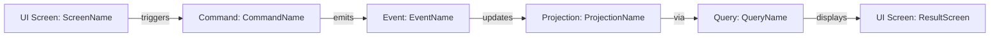
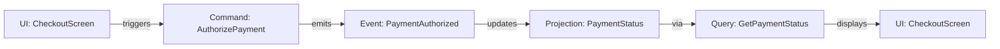
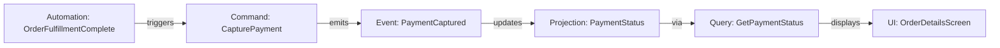

# Event Modeling Process

**This document describes the Event Modeling methodology. Individual step agents have detailed instructions in their own configurations. The main coordinator agent orchestrates the 12-step process.**

## Overview

Event Modeling is a collaborative design methodology that captures system behavior through events, commands, and data flow. This process creates living documentation that serves as both design specification and implementation guide.

**CRITICAL: Understanding Event Modeling for Client vs Service Applications**

Event Modeling focuses on **persistent state changes**, NOT ephemeral runtime behavior.

## Events = Persistent State Changes

- Events are state changes recorded indefinitely (databases, event stores, files, audit logs)
- Events MUST survive application restart
- Events represent persistent facts about what happened in the system

## What Counts as an Event

- ✅ **Configuration changes** persisted to files
- ✅ **Data written** to databases or event stores
- ✅ **Audit trail entries** for compliance/history
- ✅ **State that survives restart** or requires reconstruction
- ❌ **UI rendering** ("Displayed", "Rendered", "Focused") - ephemeral
- ❌ **Transient interactions** ("Clicked", "Pressed", "Selected") - ephemeral
- ❌ **Runtime-only state** (in-memory data structures, UI state)

## Logging vs Event Storage (CRITICAL DISTINCTION)

- **Application Logging** (DEBUG, INFO, WARN, ERROR, FATAL): Meets debugging and audit needs
- **Do NOT create separate persistent event stores** for debugging or audit trails
- **ONLY create persistent events** for actual domain state changes that require reconstruction
- **Events are for state reconstruction**, NOT debugging history

## Client Applications vs Service Applications

- **Services** typically have MANY events (every business state change persisted)
- **Client applications** typically have FEWER events (most state is ephemeral UI)
- Client applications may have very few actual events if they don't persist much state
- Most client workflows are: Command → Ephemeral State → UI Rendering (NOT Command → Event → Read Model)

## Document Structure

The event model is organized as a hierarchical documentation system:

### Primary Index

**docs/EVENT_MODEL.md** - Serves as table of contents and high-level overview

### Component Documents

All component definitions stored in separate markdown files:

- **docs/event_model/functional-areas/*.md** - Functional area documents containing workflows
- **docs/event_model/events/*.md** - Individual event definitions
- **docs/event_model/commands/*.md** - Individual command definitions
- **docs/event_model/ui-screens/*.md** - Individual UI screen definitions
- **docs/event_model/automations/*.md** - Individual automation definitions
- **docs/event_model/projections/*.md** - Individual projection definitions
- **docs/event_model/queries/*.md** - Individual query definitions
- **docs/event_model/domain_types/*.md** - Individual domain type definitions

### Rationale for Separation

Multiple smaller documents make it easier for:
- LLMs to parse and edit specific components
- Version control to track granular changes
- Teams to work on different components concurrently
- Navigation and cross-referencing between related concepts

## 12-Step Workflow Process

Apply this process to EACH workflow within a functional area. This process defines WHAT each step produces, not HOW agents coordinate:

### Step 1: Goal Event Identification

Start with the goal of the workflow. What event represents "this workflow is complete?"

**Output**: Single goal event name with 1-2 sentence description

**Example**:
```
Event: InvoiceGenerated
Description: Invoice has been generated and is ready for customer delivery.
```

### Step 2: Work Backwards Defining Events

What needs to be true to reach the goal? For each decision or state change, define an event.

**Critical Rules**:
- Define event NAMES and brief descriptions ONLY
- Do NOT define data fields yet
- Work backwards from goal to workflow start
- Each event represents a persistent state change

**Output**: Ordered list of event names (start → goal)

**Example**:
```
1. PaymentAuthorized
2. PaymentCaptured
3. OrderFulfilled
4. InvoiceGenerated (goal)
```

### Step 3: Define Commands

For each event, define the command that emits it.

**Critical Rules**:
- A command should result in either an error OR a single event
- The same command MAY emit different events based on business logic
- Different outcomes appear as distinct vertical slices
- Multiple slices may share the same command box

**Output**: Command name for each event

**Example**:
```
AuthorizePayment → PaymentAuthorized
CapturePayment → PaymentCaptured
FulfillOrder → OrderFulfilled
GenerateInvoice → InvoiceGenerated
```

### Step 4: Define Triggers

For each command, determine what triggers it:

**UI Screen Trigger**:
- Show which UI elements trigger which commands
- Label buttons, forms, and interaction points
- Single screen may trigger multiple commands

**Automation Trigger**:
- Describe high-level trigger conditions
- Explain WHY the automation triggers the command
- Reference events that initiate automation

**Critical Rule**: Both UI screens and automations can appear in multiple vertical slices and workflows

**Output**: For each command, document trigger (UI screen name or automation name)

### Step 5: Define Final UI Screen

Define what users see after the final event is recorded.

**Focus Areas**:
- Data that confirms workflow completion
- Elements that prove the goal event occurred
- Next actions available to user

**Output**: UI screen name and layout description

### Step 6: Define Queries and Projections

Working backwards from final screen, define queries and projections required to display information.

**Projection**: Pre-computed view of domain data, potentially aggregating multiple events

**Query**: Request for data from a projection

**Include**:
- Projection data tables (field names, types)
- Query parameters and return types
- Aggregation logic descriptions

**Output**: List of projections and queries with data table structures

### Step 7: Connect Projections to Events

For each projection data field, determine which event provides the source.

**Documentation Requirements**:
- Connect events to projections in vertical slice diagrams
- Document event-to-projection mappings in projection files
- Include aggregation details (SUM, COUNT, LAST, etc.)

**Output**: Event-to-projection mapping for all data fields

### Step 8: Document Event Data Fields

For each event, document all data fields.

**Critical Rule**: Ensure it's possible to get data from the command that emits the event

**Include**:
- Field name
- Data type (reference domain types)
- Brief description
- Source information

**Output**: Complete event data field tables

### Step 9: Ensure Command Data Sources

For each command data field, ensure data is available from:

1. **Event Streams**: Events loaded into command on execution
2. **Trigger Component**: Data from UI screen or automation

**Aggregate Pattern**:
- We don't use "Aggregate" as a separate architectural component
- Instead, commands aggregate events (possibly from multiple streams) into data structures
- Document aggregation conceptually, not as technical implementation

**Output**: For each command field, document data source (event stream or trigger)

### Step 10: Gherkin Acceptance Criteria

For each command, provide Gherkin-style acceptance criteria.

**Format**:
```gherkin
GIVEN [recorded event 1]    # or: GIVEN no prior events
AND [recorded event 2]       # optional
AND [recorded event N]       # optional

WHEN [command with data]

THEN [event with data or error with data]
```

**Include**:
- Relevant data examples in events
- Command parameters with example values
- Error conditions with example error data

**Location**: Acceptance criteria belong in command definition documents

**Output**: Complete Gherkin scenarios for each command

**Example**:
```gherkin
GIVEN OrderCreated with order_id="ORD-123", total_amount=150.00
AND PaymentAuthorized with order_id="ORD-123", auth_code="AUTH-456"

WHEN CapturePayment with order_id="ORD-123", amount=150.00

THEN PaymentCaptured with order_id="ORD-123", captured_amount=150.00,
     capture_time="2025-10-09T14:30:00Z"
```

### Step 11: Cross-Linking

Ensure comprehensive linking between all related components.

**Linking Requirements**:
- Component definitions link to workflows that use them
- Workflow documents link to all component definitions
- Use markdown reference-style links for maintainability

**Format**:
```markdown
See [CommandName][command-commandname] for details.

[command-commandname]: ../commands/CommandName.md
```

**Output**: Complete cross-reference links in all documents

### Step 12: Information Completeness Check

Verify complete data lineage for every field.

**Verification**:
- Every projection field traces to source event(s)
- Every event field traces to command data
- Every command field traces to event stream OR trigger component
- All external data sources explicitly identified

**Critical Rule**: Every data field MUST be traceable back to its original, external-to-the-system source

**Output**: Data lineage verification for entire workflow

## Vertical Slice Format (MANDATORY)

Each vertical slice MUST follow this LINEAR, UNIDIRECTIONAL format:

```
(UI or Automation) → Command → Event → Projection → Query → (UI or external-service)
```

### Vertical Slice Rules

1. **Linear Flow**: Each slice flows in ONE direction only (no forking within a single slice)
2. **Separate Slices**: If one event updates multiple projections, create SEPARATE vertical slices
3. **Shared Entities**: Multiple slices can reference shared entity description blocks
4. **Complete Journey**: Show full flow from trigger to result
5. **UI Context**: Include layout context (panes, panels, sections) in wireframes

## Workflow Documents with Mermaid Diagrams

Each workflow file (**docs/event_model/functional-areas/*.md**) should contain:

### Structure

1. **Workflow Overview**: Goal and context
2. **Vertical Slices**: One section per slice
3. **Component Links**: References to all component definitions

### Mermaid Diagram Format



### Ordering

- Vertical slices ordered as they appear in the workflow
- Each slice shows complete information flow
- Links to component definitions provided (not repeating full details)

## Component Definition Documents

### Event Definitions (docs/event_model/events/*.md)

**Structure**:
```markdown
## Event: EventName

### Description
[1-2 sentence description of what this event represents]

### Data Fields

| Field Name | Type | Description | Source |
|------------|------|-------------|--------|
| field_1 | [DomainType](../domain_types/TypeName.md) | Description | Command: CommandName |
| field_2 | [DomainType](../domain_types/TypeName.md) | Description | Command: CommandName |

### Emitted By
- [CommandName](../commands/CommandName.md)

### Updates Projections
- [ProjectionName](../projections/ProjectionName.md)

### Used In Workflows
- [WorkflowName](../functional-areas/AreaName.md#workflow-name)
```

### Command Definitions (docs/event_model/commands/*.md)

**Structure**:
```markdown
## Command: CommandName

### Description
[1-2 sentence description of what this command does]

### Data Fields

| Field Name | Type | Description | Source |
|------------|------|-------------|--------|
| field_1 | [DomainType](../domain_types/TypeName.md) | Description | [SourceType]: SourceName |
| field_2 | [DomainType](../domain_types/TypeName.md) | Description | [SourceType]: SourceName |

[SourceType] = "UI Screen" | "Automation" | "Event Stream" | "External API"

### Event Aggregation
[If command loads events, describe aggregation logic conceptually]

Example:
- Loads all OrderLineItemAdded events for order_id
- Aggregates to compute total_items and total_amount

### Triggered By
- [UI Screen: ScreenName](../ui-screens/ScreenName.md)
- OR [Automation: AutomationName](../automations/AutomationName.md)

### Emits Events
- Success: [EventName](../events/EventName.md)
- Error: [ErrorType with description]

### Acceptance Criteria

```gherkin
GIVEN [recorded event 1]
AND [recorded event 2]

WHEN [command with example data]

THEN [event with example data or error with example data]
```

[Include multiple scenarios for different conditions]

### Used In Workflows
- [WorkflowName](../functional-areas/AreaName.md#workflow-name)
```

### UI Screen Definitions (docs/event_model/ui-screens/*.md)

**Structure**:
```markdown
## UI Screen: ScreenName

### Description
[1-2 sentence description of screen purpose]

### Layout Context
[Describe where screen appears: main window, dialog, panel, etc.]

### ASCII Wireframe

```
┌─────────────────────────────────────────┐
│ Screen Title                            │
│ ┌─────────────────────────────────────┐ │
│ │ [Input Field 1]                     │ │
│ │ [Input Field 2]                     │ │
│ │ [Button: Action Name]               │ │
│ └─────────────────────────────────────┘ │
└─────────────────────────────────────────┘
```

### Displayed Data

| Data Element | Source Query | Description |
|--------------|--------------|-------------|
| element_1 | [QueryName](../queries/QueryName.md) | Description |
| element_2 | [QueryName](../queries/QueryName.md) | Description |

### Triggers Commands
- [CommandName](../commands/CommandName.md) - via [Button/Action description]

### Used In Workflows
- [WorkflowName](../functional-areas/AreaName.md#workflow-name)
```

### Automation Definitions (docs/event_model/automations/*.md)

**Structure**:
```markdown
## Automation: AutomationName

### Description
[1-2 sentence description of automation purpose]

### Trigger Conditions
[Describe what initiates this automation]

Examples:
- Event received: [EventName](../events/EventName.md)
- Time-based: Daily at 2:00 AM UTC
- External webhook from ServiceName

### Trigger Logic
[Explain WHY automation triggers commands]

Example:
When InvoiceGenerated event recorded, automatically trigger SendInvoiceEmail
to notify customer of available invoice.

### Triggers Commands
- [CommandName](../commands/CommandName.md) - [condition description]

### Used In Workflows
- [WorkflowName](../functional-areas/AreaName.md#workflow-name)
```

### Projection Definitions (docs/event_model/projections/*.md)

**Structure**:
```markdown
## Projection: ProjectionName

### Description
[1-2 sentence description of projection purpose]

### Data Table

| Field Name | Type | Description | Source Event | Aggregation |
|------------|------|-------------|--------------|-------------|
| field_1 | [DomainType](../domain_types/TypeName.md) | Description | [EventName](../events/EventName.md) | LAST |
| field_2 | [DomainType](../domain_types/TypeName.md) | Description | [EventName](../events/EventName.md) | SUM |

### Aggregation Types
- **LAST**: Most recent event value
- **FIRST**: Initial event value
- **SUM**: Numeric sum across events
- **COUNT**: Count of events
- **LIST**: Collection of values
- **CUSTOM**: [Describe custom aggregation logic]

### Updated By Events
- [EventName](../events/EventName.md)

### Queried By
- [QueryName](../queries/QueryName.md)

### Used In Workflows
- [WorkflowName](../functional-areas/AreaName.md#workflow-name)
```

### Query Definitions (docs/event_model/queries/*.md)

**Structure**:
```markdown
## Query: QueryName

### Description
[1-2 sentence description of query purpose]

### Parameters

| Parameter | Type | Description | Required |
|-----------|------|-------------|----------|
| param_1 | [DomainType](../domain_types/TypeName.md) | Description | Yes/No |

### Returns

| Field Name | Type | Description |
|------------|------|-------------|
| field_1 | [DomainType](../domain_types/TypeName.md) | Description |

### Source Projection
- [ProjectionName](../projections/ProjectionName.md)

### Used By UI Screens
- [ScreenName](../ui-screens/ScreenName.md)

### Used In Workflows
- [WorkflowName](../functional-areas/AreaName.md#workflow-name)
```

### Domain Type Definitions (docs/event_model/domain_types/*.md)

**Structure**:
```markdown
## Domain Type: TypeName

### Description
[1-2 sentence description of what this type represents in the domain]

### Type Definition

**Base Type**: [String | Integer | Decimal | Boolean | DateTime | UUID | List | Object]

**Constraints**:
- [Constraint description]

Examples:
- Min length: 3 characters
- Max length: 100 characters
- Pattern: ^[A-Z]{3}-[0-9]{6}$
- Range: 0.00 to 999999.99
- Time zone: UTC

### Example Values
```
value_1
value_2
value_3
```

### Used In
- [Event: EventName](../events/EventName.md)
- [Command: CommandName](../commands/CommandName.md)
- [Projection: ProjectionName](../projections/ProjectionName.md)
- [Query: QueryName](../queries/QueryName.md)
```

## Domain Types

Create separate documents in **docs/event_model/domain_types/** for each discrete domain concept.

**Purpose**:
- Define real domain types for each field
- Ensure consistent types across components
- Capture business rules and constraints
- Enable type reuse across the model

**Reusability**:
- A domain type can be used for multiple fields
- Same type can appear in different components
- Reference types consistently using markdown links

**Examples**:
- OrderId.md
- EmailAddress.md
- MonetaryAmount.md
- OrderStatus.md
- CustomerId.md

## UI Wireframes (MANDATORY for UI-Intensive Workflows)

ASCII wireframes should be created for workflows involving UI interaction.

### Input Wireframe

Show what user interacts with:
- Form fields, text inputs, buttons
- Layout context (which pane/panel)
- User action trigger (e.g., "Press Enter to Send")

### Output Wireframe

Show what user sees as result:
- Displayed data, updated views
- Layout context (which pane/panel)
- Visual representation of outcome

### Vertical Slice Integration

Connect wireframes to workflow:
- Input wireframe → Command
- Command → Event (if persistent state change)
- Event → Projection → Query
- Query → Output wireframe

### Example

```
[UI Wireframe: Input]
┌─────────────────────────────────────────┐
│ Order Entry Panel                       │
│ ┌─────────────────────────────────────┐ │
│ │ Product: [Dropdown]                 │ │
│ │ Quantity: [___]                     │ │
│ │ [Add to Order Button]               │ │
│ └─────────────────────────────────────┘ │
└─────────────────────────────────────────┘

↓ Command: AddOrderLineItem
↓ Event: OrderLineItemAdded
↓ Projection: OrderSummary
↓ Query: GetOrderSummary

[UI Wireframe: Output]
┌─────────────────────────────────────────┐
│ Order Summary Panel                     │
│ ┌─────────────────────────────────────┐ │
│ │ Items: 3                            │ │
│ │ Subtotal: $150.00                   │ │
│ │ Tax: $12.00                         │ │
│ │ Total: $162.00                      │ │
│ └─────────────────────────────────────┘ │
└─────────────────────────────────────────┘
```

## Cross-Linking Best Practices

### Reference-Style Links

Use markdown reference-style links for maintainability:

```markdown
See [CommandName][cmd-commandname] for command details.
See [EventName][evt-eventname] for event structure.

[cmd-commandname]: ../commands/CommandName.md
[evt-eventname]: ../events/EventName.md
```

### Link Prefixes

Use consistent prefixes for different component types:
- Commands: `cmd-`
- Events: `evt-`
- UI Screens: `ui-`
- Automations: `auto-`
- Projections: `proj-`
- Queries: `qry-`
- Domain Types: `type-`
- Workflows: `wf-`

### Bidirectional Links

Ensure links work in both directions:
- Workflows link to components they use
- Components link back to workflows that use them

## Complete Example: Payment Processing Workflow

### Functional Area Document (docs/event_model/functional-areas/PaymentProcessing.md)

```markdown
## Functional Area: Payment Processing

### Overview
Handles customer payment authorization, capture, and reconciliation for orders.

### Workflows
- [Payment Authorization and Capture](#payment-authorization-and-capture)
- Payment Refund Processing
- Payment Reconciliation

---

### Payment Authorization and Capture

**Goal**: Successfully capture payment for customer order.

#### Vertical Slice 1: Authorize Payment



**Flow**:
1. Customer clicks "Complete Purchase" on [CheckoutScreen][ui-checkout]
2. Triggers [AuthorizePayment][cmd-authorize] command with order_id and payment_details
3. Emits [PaymentAuthorized][evt-authorized] event with authorization_code
4. Updates [PaymentStatus][proj-status] projection with authorized status
5. [GetPaymentStatus][qry-status] query retrieves current status
6. [CheckoutScreen][ui-checkout] displays "Payment Authorized - Processing Order"

#### Vertical Slice 2: Capture Payment



**Flow**:
1. [OrderFulfillmentComplete][auto-fulfill] automation detects OrderFulfilled event
2. Triggers [CapturePayment][cmd-capture] command with order_id
3. Emits [PaymentCaptured][evt-captured] event with capture confirmation
4. Updates [PaymentStatus][proj-status] projection with captured status
5. [GetPaymentStatus][qry-status] query retrieves updated status
6. [OrderDetailsScreen][ui-order] displays "Payment Captured - Order Complete"

[ui-checkout]: ../ui-screens/CheckoutScreen.md
[ui-order]: ../ui-screens/OrderDetailsScreen.md
[cmd-authorize]: ../commands/AuthorizePayment.md
[cmd-capture]: ../commands/CapturePayment.md
[evt-authorized]: ../events/PaymentAuthorized.md
[evt-captured]: ../events/PaymentCaptured.md
[proj-status]: ../projections/PaymentStatus.md
[qry-status]: ../queries/GetPaymentStatus.md
[auto-fulfill]: ../automations/OrderFulfillmentComplete.md
```

### Command Document (docs/event_model/commands/CapturePayment.md)

```markdown
## Command: CapturePayment

### Description
Captures previously authorized payment for an order, transferring funds from customer to merchant account.

### Data Fields

| Field Name | Type | Description | Source |
|------------|------|-------------|--------|
| order_id | [OrderId](../domain_types/OrderId.md) | Unique order identifier | Automation: OrderFulfillmentComplete |
| capture_amount | [MonetaryAmount](../domain_types/MonetaryAmount.md) | Amount to capture | Event Stream: OrderCreated |
| authorization_code | [AuthorizationCode](../domain_types/AuthorizationCode.md) | Authorization to capture | Event Stream: PaymentAuthorized |

### Event Aggregation

Loads events for order:
- OrderCreated event → provides order_total
- PaymentAuthorized event → provides authorization_code
- Validates capture_amount ≤ authorized_amount

### Triggered By
- [Automation: OrderFulfillmentComplete](../automations/OrderFulfillmentComplete.md)

### Emits Events
- **Success**: [PaymentCaptured](../events/PaymentCaptured.md)
- **Error**: PaymentCaptureError - when authorization expired, amount exceeds authorized, or payment gateway failure

### Acceptance Criteria

#### Scenario: Successful payment capture

```gherkin
GIVEN OrderCreated with order_id="ORD-123", total_amount=150.00
AND PaymentAuthorized with order_id="ORD-123", auth_code="AUTH-456",
    authorized_amount=150.00
AND OrderFulfilled with order_id="ORD-123"

WHEN CapturePayment with order_id="ORD-123", capture_amount=150.00,
     authorization_code="AUTH-456"

THEN PaymentCaptured with order_id="ORD-123", captured_amount=150.00,
     capture_time="2025-10-09T14:30:00Z", transaction_id="TXN-789"
```

#### Scenario: Capture amount exceeds authorization

```gherkin
GIVEN OrderCreated with order_id="ORD-123", total_amount=150.00
AND PaymentAuthorized with order_id="ORD-123", auth_code="AUTH-456",
    authorized_amount=150.00

WHEN CapturePayment with order_id="ORD-123", capture_amount=175.00,
     authorization_code="AUTH-456"

THEN PaymentCaptureError with order_id="ORD-123", error_code="AMOUNT_EXCEEDED",
     message="Capture amount $175.00 exceeds authorized amount $150.00"
```

#### Scenario: Authorization expired

```gherkin
GIVEN OrderCreated with order_id="ORD-123", total_amount=150.00
AND PaymentAuthorized with order_id="ORD-123", auth_code="AUTH-456",
    authorized_at="2025-10-02T14:30:00Z", expires_at="2025-10-09T14:30:00Z"
AND current_time="2025-10-10T10:00:00Z"

WHEN CapturePayment with order_id="ORD-123", capture_amount=150.00,
     authorization_code="AUTH-456"

THEN PaymentCaptureError with order_id="ORD-123", error_code="AUTHORIZATION_EXPIRED",
     message="Authorization AUTH-456 expired on 2025-10-09T14:30:00Z"
```

### Used In Workflows
- [Payment Authorization and Capture](../functional-areas/PaymentProcessing.md#payment-authorization-and-capture)
```

## Key Principles Summary

1. **Events = Persistent State Changes**: Only model state that survives restart
2. **Logging ≠ Events**: Use application logging for debugging/audit, not event stores
3. **Client vs Service**: Clients have fewer events (most state is ephemeral)
4. **12-Step Process**: Follow systematically for complete workflows
5. **Vertical Slices**: Linear, unidirectional flow (no forking within slice)
6. **Separate Documents**: One file per component for clarity and maintainability
7. **Domain Types**: Define real types for every field
8. **Gherkin Acceptance**: Complete scenarios with example data
9. **Data Lineage**: Every field traces back to external source
10. **Cross-Linking**: Bidirectional links between all related components
11. **Living Documentation**: Evolves but aim for completeness before development

## Conclusion

Event modeling creates comprehensive, collaborative design documentation that:
- Captures system behavior through events and commands
- Provides clear acceptance criteria for development
- Ensures complete data lineage from external sources to UI
- Enables effective communication across technical and non-technical stakeholders
- Serves as living documentation throughout project lifecycle

Apply the 12-step process systematically to each workflow, maintain separation of concerns through individual component files, and ensure bidirectional cross-linking for maximum utility.
